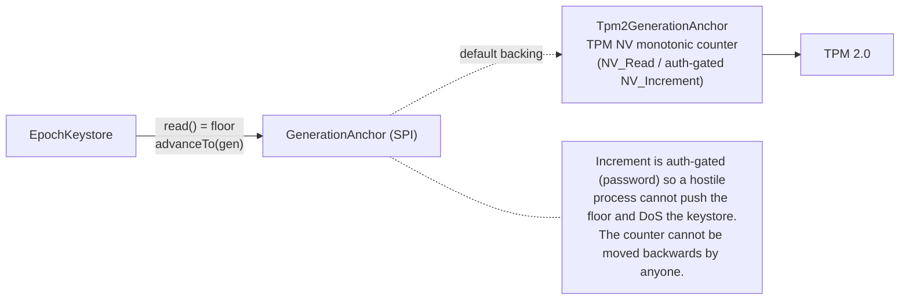
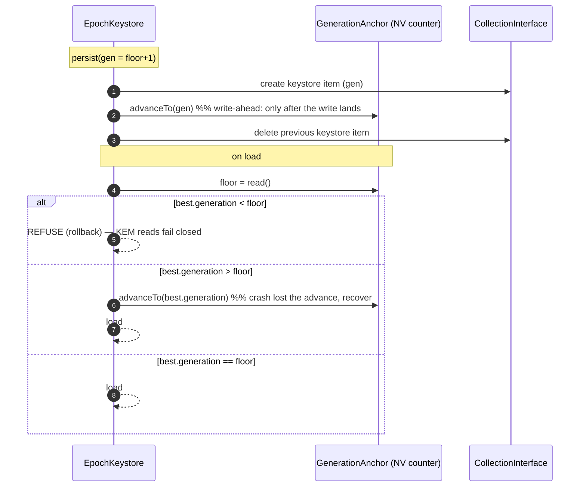

# Anti-rollback anchor

Highest-generation-wins (see [epoch-keystore](epoch-keystore-and-forward-secrecy.md)) defeats a crash-orphaned duplicate, but **not** an attacker with write access to the keyring store who deletes the current keystore item and re-introduces a genuine *older* one — that would resurrect epoch keys `rotateEpoch` destroyed, silently undoing forward secrecy.

A `GenerationAnchor` closes that gap by holding the highest generation ever committed in storage the attacker cannot roll back. The canonical backing is a **TPM NV monotonic counter**: it can be incremented but never decremented, even by the owner.

Source: `GenerationAnchor` (SPI, core hardened), `Tpm2GenerationAnchor` (tpm2), `EpochKeystore`.

To actually get one, see [TPM 2.0 usage → Provision the anti-rollback counter](../usage/tpm2.md#provision-the-anti-rollback-counter). Note that an anchor must back exactly **one** collection: the floor is global while each collection keeps its own generation seeded from it, so sharing an anchor pushes each collection below the other's floor and both fail closed. A second `HardenedCollection` on the same anchor is refused at construction.

## Where the anchor sits

## Write-ahead ordering + window-0 rule

The keystore advances the anchor **after** the new snapshot is durably written, and on load treats the anchor as a strict floor:

- **Rollback attack** → attacker can only present a genuine snapshot, all of which have `generation ≤ floor`; anything `< floor` is refused, so a rolled-back keystore cannot be made to look current.
- **Crash between write and advance** → the surviving snapshot has `generation > floor`; that is a *lost advance*, not a rollback, so it loads and catches the counter up. No data loss.

Without an anchor configured, behaviour is unchanged (`generation++`, highest-wins), i.e. the anchor is purely additive.

## Correctness (proven by)

Core (in-memory `FakeAnchor`, daemon-free):

| Property | Test |
|----------|------|
| Generation lives in the anchor's value space | `EpochKeystoreTest.generationLivesInTheAnchorValueSpace` |
| A rolled-back (below-floor) keystore is refused; nothing loads | `EpochKeystoreTest.anchorRefusesRolledBackKeystore` |
| A lost-advance (above-floor) snapshot loads and catches the anchor up | `EpochKeystoreTest.anchorCatchesUpWhenKeystoreGenerationExceedsFloor` |
| End-to-end via the Builder, a raised floor makes reads fail closed | `HardenedCollectionTest.generationAnchorWiredThroughBuilderIsConsultedAndFailsClosed` |

TPM (simulator-gated, `-Psystem-test`):

| Property | Test |
|----------|------|
| The NV counter is monotonic and `advanceTo` is idempotent | `Tpm2GenerationAnchorTest.counterIsMonotonicAndAdvanceIsIdempotent` |
| The value never decreases across a reopen | `Tpm2GenerationAnchorTest.anchorValueSurvivesReopen` |
| An unprovisioned counter fails fast at construction | `Tpm2GenerationAnchorTest.undefinedCounterFailsFastAtConstruction` |
