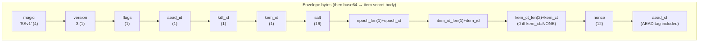
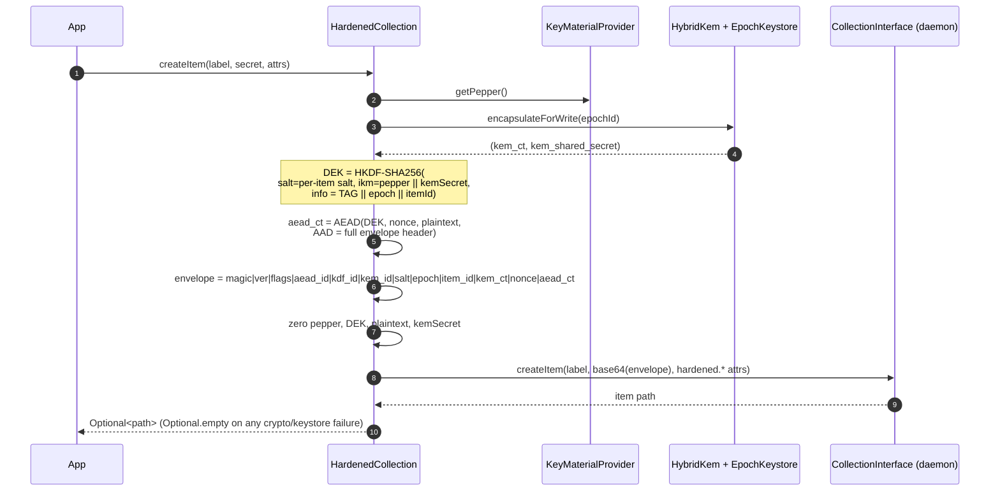
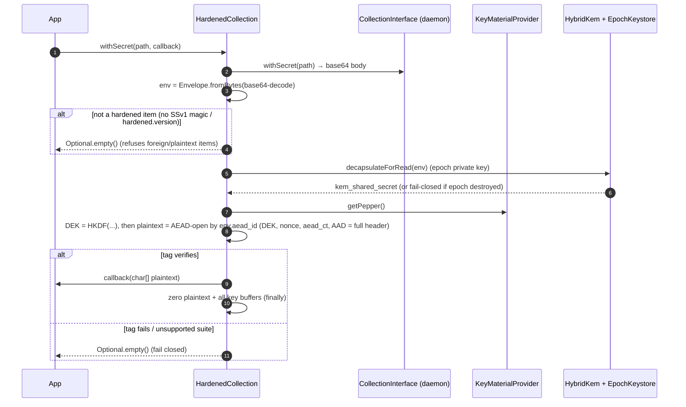

# Envelope encryption (write / read)

Each secret body is sealed in an **AEAD envelope** (AES-256-GCM by default, or ChaCha20-Poly1305) under a per-item data-encryption key (DEK). The DEK is derived fresh per item with HKDF-SHA256: the secret inputs — the application **pepper** and the **KEM shared secret** — form the HKDF input keying material mixed with a per-item random **salt**; the public context (a domain tag, the **epoch id**, the **item id**) is the HKDF info. No key is stored; the DEK is recomputed on read from the same inputs.

Source: `HardenedCollection.createItem` / `decryptToChars` / `deriveDek`, `Envelope`.

## Wire format (the item body, base64-encoded)

The 4-byte `magic` is the fixed family tag `SSv1` (unchanged across revisions); the authoritative format version is the separate 1-byte `version` field, currently **3**. Parsing rejects v1 and v2 (`fromBytes` accepts only v3). The `aead_id` / `kdf_id` / `kem_id` selector bytes name the cipher suite so a new AEAD, KDF, or KEM lands without a format migration.

Alongside the body, non-secret **index metadata** travels as item attributes: `hardened.version`, `hardened.epoch`, `hardened.aead`, `hardened.kdf`, `hardened.kem`, `hardened.kem.id`, `hardened.item.id`. These are non-authoritative — the item id and cipher suite are read from the authenticated envelope header, never from the attributes. The `kem_id == NONE  ⇔  kem_ct is empty` invariant is enforced by the `Envelope` constructor.

## Write — `createItem`

The whole sealing body runs in one `try/finally` so **every** key buffer is zeroed even on an exception path, and the method returns `Optional.empty()` rather than throwing on a KEM/AEAD failure (fail-safe contract). The AEAD is selectable via `Builder.aead(AeadId)` (AES-256-GCM default, or ChaCha20-Poly1305) and recorded in the authenticated `aead_id` byte.

## Read — `getSecret` / `withSecret`

The plaintext is handed to the callback as a `char[]` and zeroed in a `finally` block; the library never returns a `String` and never leaves plaintext on the heap past the callback.

## Correctness (proven by)

| Property | Test |
|----------|------|
| Write then read returns the exact plaintext | `HardenedCollectionTest.createAndReadRoundTrip`, `postQuantumRoundTripWritesKemCtAndRecoversPlaintext` |
| The stored body is a `SSv1` envelope, not plaintext | `emittedSecretIsBase64EnvelopeNotPlaintext` |
| Default (non-PQ) write uses the classical X25519 KEM, non-empty `kem_ct` | `defaultBuilderWritesKemIdX25519` |
| Wrong pepper cannot decrypt (fail closed) | `wrongPepperFailsClosed` |
| Tampered / non-base64 body yields empty, not a crash | `matchesSecretEmptyForTamperedEnvelope`, `withSecretsFailsFastOnAnyItemFailure` |
| Foreign / plaintext items in a shared collection are refused | `refusesPlaintextItemInSharedCollection`, `withSecretsScopesToHardenedItemsOnly` |
| Envelope round-trips every field; rejects bad magic/version/lengths | `EnvelopeTest.roundTripPreservesAllFields_*`, `magicIsRequired`, `rejectsUnsupportedVersion`, `rejectsTruncatedInput`, `rejectsInvalidSaltLengthField`, `rejectsTooShortAeadCiphertext` |
| `kem_id`/`kem_ct` consistency invariant holds | `EnvelopeTest.kemIdAndKemCtMustBeConsistent` |
| Tampering any header byte fails AEAD authentication (full-header AAD) | `tamperingWithEnvelopeHeaderFailsAuthentication` |
| ChaCha20-Poly1305 items round-trip and stamp `aead_id` | `chaCha20Poly1305RoundTrips`, `AeadTest.*` |
| Envelope parser survives arbitrary/adversarial input (fuzzed) | `EnvelopeFuzzTest.fromBytesOnlyThrowsIllegalArgument` |
| `matchesSecret` is constant-time and plaintext-free | `matchesSecretReturnsTrueForEquality`, `...FalseForMismatch`, `constantTimeEqualsIsLengthIndependentOfFirstMismatchIndex` |
