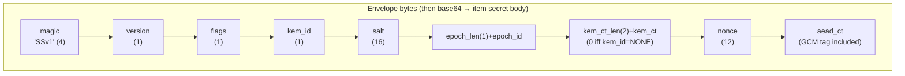
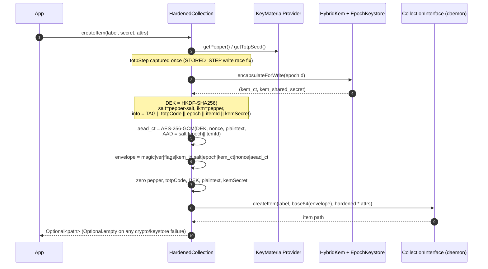
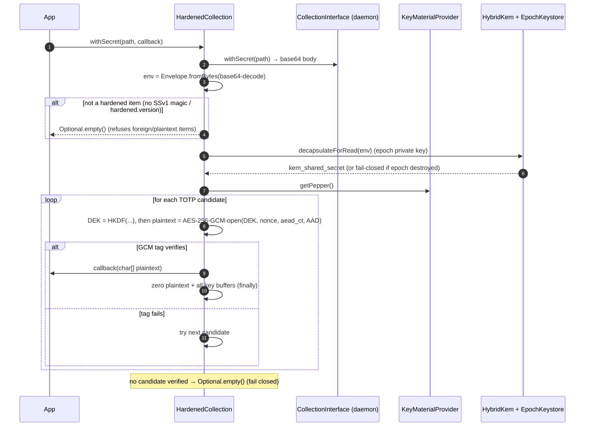

# Envelope encryption (write / read)

Each secret body is sealed in an **AES-256-GCM envelope** under a per-item data-encryption key (DEK). The DEK is derived fresh per item with HKDF-SHA256 from: the application **pepper**, an optional **TOTP code**, a per-item random **salt**, the **epoch id**, the **item id**, and the **KEM shared secret**. No key is stored; the DEK is recomputed on read from the same inputs.

Source: `HardenedCollection.createItem` / `decryptToChars` / `deriveDek`, `Envelope`.

## Wire format (the item body, base64-encoded)

Alongside the body, non-secret attributes travel as item metadata: `hardened.version`, `hardened.epoch`, `hardened.totp.mode` (+ `hardened.totp.step` for `STORED_STEP`), `hardened.kem`, `hardened.kem.id`, `hardened.item.id`. The `kem_id == NONE  ⇔  kem_ct is empty` invariant is enforced by the `Envelope` constructor.

## Write — `createItem`

The whole sealing body runs in one `try/finally` so **every** key buffer is zeroed even on an exception path, and the method returns `Optional.empty()` rather than throwing on a KEM/AES failure (fail-safe contract).

## Read — `getSecret` / `withSecret`

The plaintext is handed to the callback as a `char[]` and zeroed in a `finally` block; the library never returns a `String` and never leaves plaintext on the heap past the callback.

## Correctness (proven by)

| Property | Test |
|----------|------|
| Write then read returns the exact plaintext | `HardenedCollectionTest.createAndReadRoundTrip`, `postQuantumRoundTripWritesKemCtAndRecoversPlaintext` |
| The stored body is a `SSv1` envelope, not plaintext | `emittedSecretIsBase64EnvelopeNotPlaintext` |
| Default (non-PQ) write uses the classical X25519 KEM, non-empty `kem_ct` | `defaultBuilderWritesKemIdX25519` |
| Wrong pepper cannot decrypt (fail closed) | `wrongPepperFailsClosed` |
| Tampered / non-base64 body yields empty, not a crash | `matchesSecretEmptyForTamperedEnvelope`, `withSecretsFailsFastOnAnyItemFailure` |
| Foreign / plaintext items in a shared collection are refused | `refusesPlaintextItemInSharedCollection`, `withSecretsScopesToHardenedItemsOnly` |
| Envelope round-trips every field; rejects bad magic/version/lengths | `EnvelopeTest.roundTripPreservesAllFields_*`, `magicIsRequired`, `rejectsUnsupportedVersion`, `rejectsTruncatedInput`, `rejectsInvalidSaltLengthField`, `rejectsTooShortAeadCiphertext` |
| `kem_id`/`kem_ct` consistency invariant holds | `EnvelopeTest.kemIdAndKemCtMustBeConsistent` |
| Reads survive a step rollover during write | `storedStepSurvivesStepRolloverDuringWrite` |
| `matchesSecret` is constant-time and plaintext-free | `matchesSecretReturnsTrueForEquality`, `...FalseForMismatch`, `constantTimeEqualsIsLengthIndependentOfFirstMismatchIndex` |
