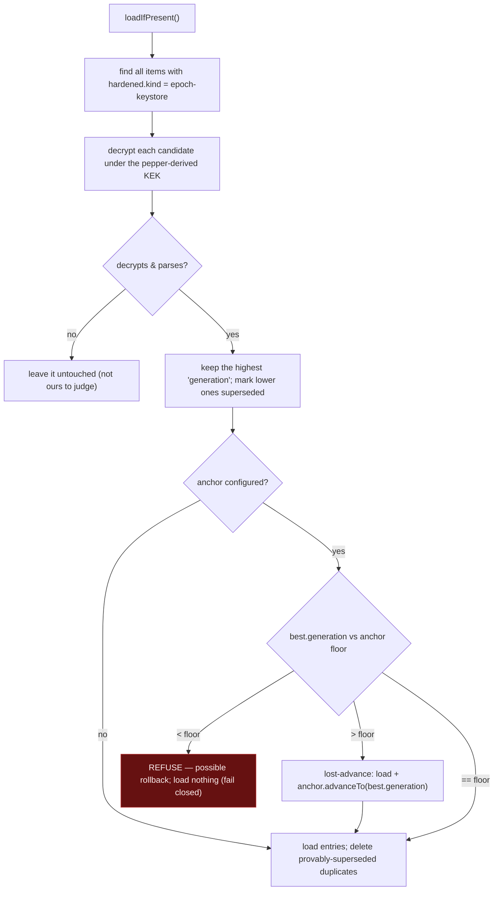
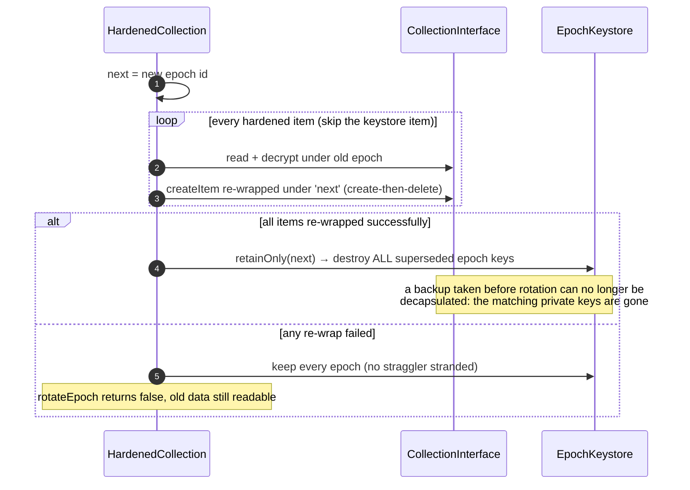

# EpochKeystore & forward secrecy

The `EpochKeystore` holds `epoch_id → (X25519 keypair, optional ML-KEM keypair)` and is persisted as a **single encrypted item** inside the wrapped collection (AES-256-GCM under a pepper-derived KEK). It is the only copy of the epoch private keys, so two properties matter:

1. **Never lose it** — persistence is *create-then-delete*, so a crash can never leave zero keystores.
2. **Be able to destroy it** — `rotateEpoch` deletes superseded epoch keys, which is exactly what gives forward secrecy.

Source: `EpochKeystore.persist` / `loadIfPresent` / `retainOnly`, `HardenedCollection.rotateEpoch`.

## Persist — create-then-delete (no data loss)

```mermaid
stateDiagram-v2
    direction LR
    [*] --> Compute: getOrCreate / removeEpoch / retainOnly
    Compute --> Create: gen = max(gen, anchor.read())+1; serialize(v2, gen, entries)
    Create --> Advance: new keystore item written (old one still present)
    Advance --> Delete: anchor.advanceTo(gen)  (write-ahead)
    Delete --> [*]: delete previous keystore item

    Create --> CrashA: crash
    Advance --> CrashB: crash
    CrashA --> Recover: two items exist → next load keeps highest generation, deletes the other
    CrashB --> Recover: previous item lingers → next load supersedes & removes it
    note right of Create
        Old keystore survives until the
        replacement is durably written.
        A delete-first crash would make
        every KEM-wrapped item unreadable.
    end note
```

## Load — highest generation wins

## `rotateEpoch` — forward secrecy by destruction

Because a fully successful rewrap proves no surviving item references an older epoch, `retainOnly(next)` can destroy every superseded epoch without stranding anything.

## Correctness (proven by)

| Property | Test |
|----------|------|
| A failed persist leaves the old keystore intact and loadable (no data loss) | `EpochKeystoreTest.persistFailureLeavesOldKeystoreIntactAndLoadable` |
| Load picks the highest generation and removes provably-superseded duplicates | `EpochKeystoreTest.loadPicksHighestGenerationAndRemovesSupersededDuplicate` |
| A keystore under a different pepper is left untouched (not deleted) | `EpochKeystoreTest.undecryptableForeignKeystoreIsLeftUntouched` |
| An epoch loaded in a later session is usable for both read and write | `HardenedCollectionTest.writeUnderEpochLoadedFromKeystoreAcrossSessions` |
| `rotateEpoch` is create-then-delete and survives a create failure | `rotateEpochCreatesThenDeletes`, `rotateEpochSurvivesCreateFailure` |
| A pre-rotation envelope is unreadable after rotation — PQ **and** classical | `rotateEpochProvidesForwardSecrecyForPqItems`, `classicalKemProvidesForwardSecrecyWithoutPq` |
| Rotation destroys **all** superseded epochs, not just the previous one | `rotateEpochDestroysAllSupersededEpochsNotJustPrevious` |
