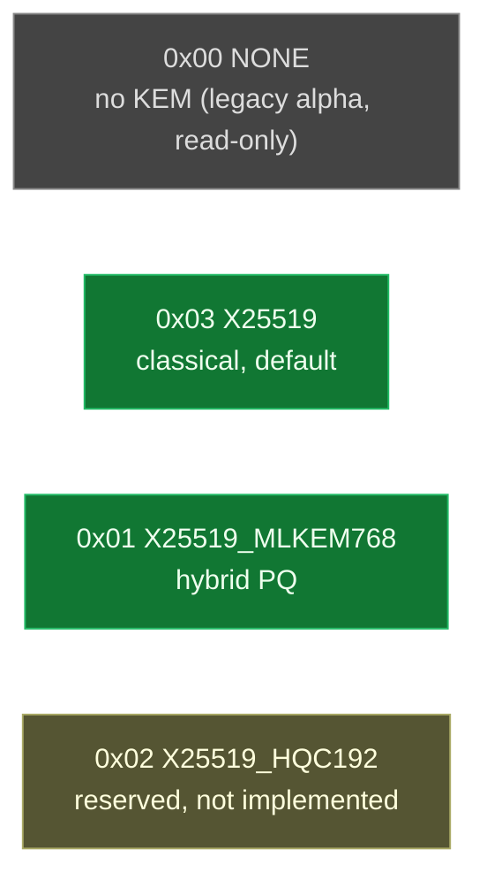
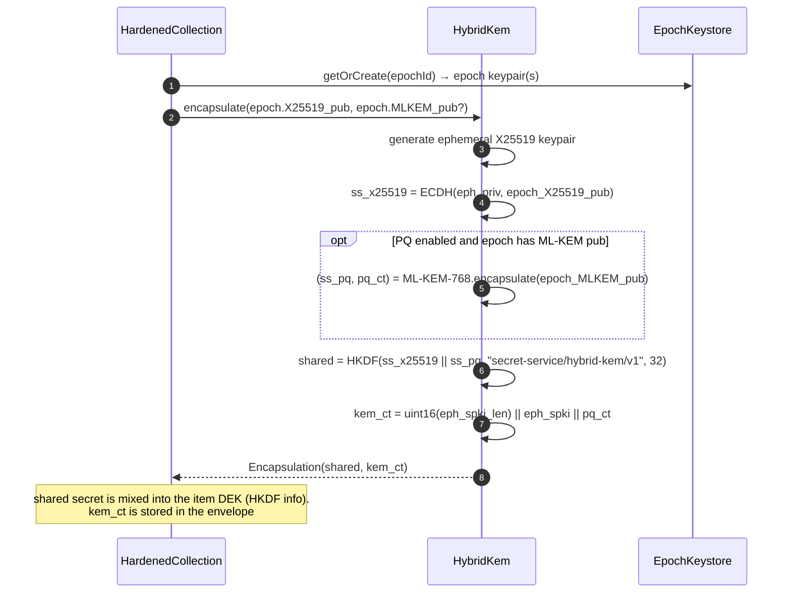
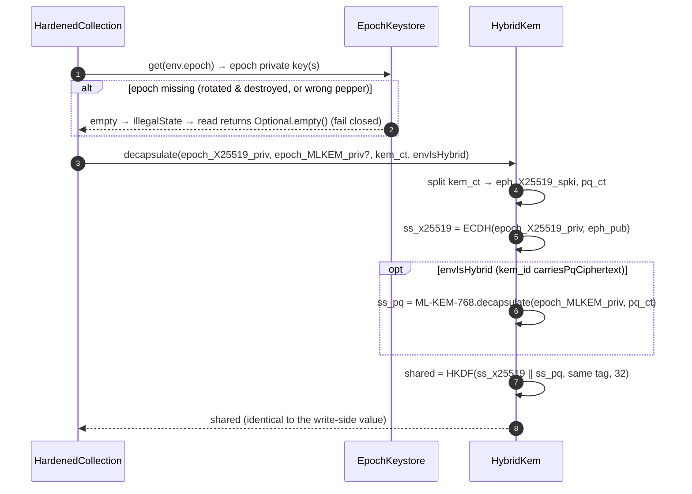

# Hybrid KEM (X25519 + optional ML-KEM-768)

The KEM binds each item's DEK to a **per-epoch keypair** held in the `EpochKeystore`, so destroying the epoch key (via `rotateEpoch`) makes prior envelopes undecryptable — the forward-secrecy primitive. The KEM is **always on**: classical X25519 by default (`kem_id = 0x03`), or hybrid X25519 + ML-KEM-768 (`kem_id = 0x01`) when `enablePostQuantum(true)` and the runtime provides ML-KEM.

Source: `HybridKem`, `KemId`, `Envelope`.

## `kem_id` values

`KemId` (an enum, not bare bytes) is the single source of truth for the id, its label, and whether it `carriesPqCiphertext()` — so the write flag and the read "is hybrid?" decision can never disagree.

## Encapsulate (write side)

## Decapsulate (read side)

`envIsHybrid` is derived from `KemId.fromId(env.kemId()).carriesPqCiphertext()`. A hybrid-flagged envelope whose `kem_ct` has no PQ part is **rejected** rather than silently downgraded.

## Correctness (proven by)

| Property | Test |
|----------|------|
| Classical encapsulate/decapsulate agree on the shared secret | `HybridKemTest.classicalEncapDecapRoundTrip` |
| Hybrid encapsulate/decapsulate agree (when ML-KEM available) | `HybridKemTest.hybridEncapDecapRoundTrip_whenPqAvailable` |
| `postQuantumAvailable()` and the `kem_id`/label are honest | `HybridKemTest.postQuantumFlagIsHonest`, `disabledPqAlwaysReportsClassicalOnly` |
| Hybrid-flagged but PQ-less ciphertext is rejected, not downgraded | `HybridKemTest.hybridDecapFailsIfFlaggedHybridButCiphertextHasNoPqPart` |
| `kem_ct` carries a length-prefixed X25519 SPKI | `HybridKemTest.packedKemCiphertextHasLengthPrefix` |
| Full PQ write→read round-trip recovers the plaintext | `HardenedCollectionTest.postQuantumRoundTripWritesKemCtAndRecoversPlaintext` |
| Legacy `kem_id = NONE` envelopes still read (routed to the pepper-only path) | `HardenedCollectionTest.legacyKemIdNoneEnvelopeIsToleratedNotRejectedByKeystore` |
| All reserved `kem_id` bytes round-trip through the envelope | `EnvelopeTest.kemIdRoundTripsAllReservedValues`, `kemIdLabelIsSensible` |
