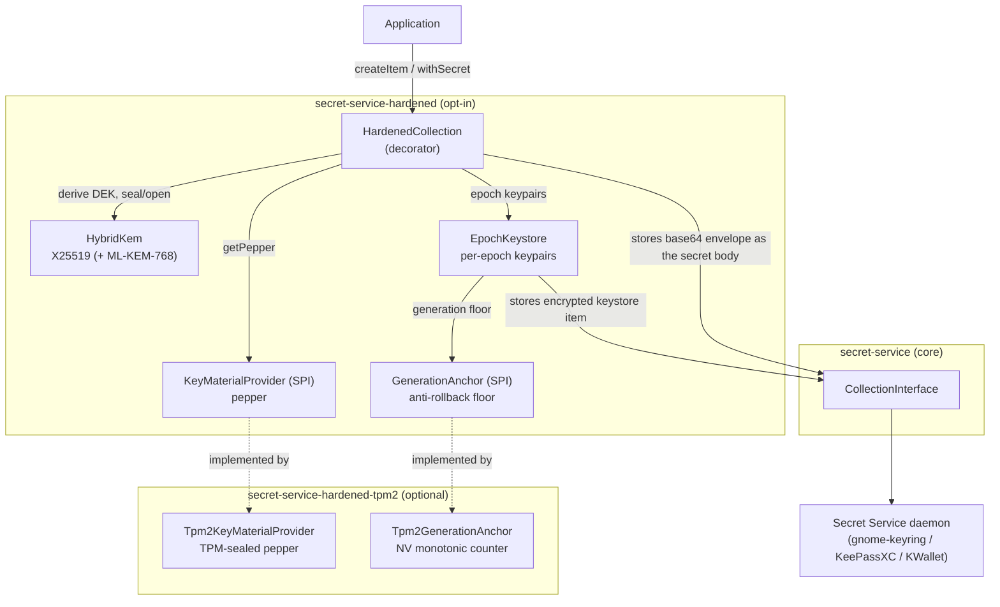
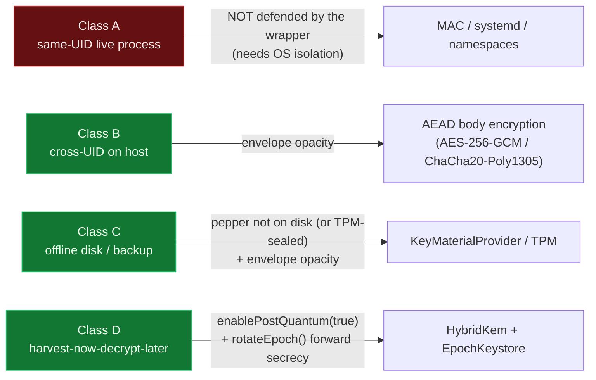

# Hardened architecture

Visual documentation of how the **`secret-service-hardened`** application-layer encryption works, and — via the test suite — evidence that each mechanism behaves correctly.

Every diagram maps to real code and to the tests that pin the behaviour. "Correctness (proven by)" lists the JUnit methods that would fail if the property broke; run them with:

```bash
mvn test -pl hardened -am            # crypto + keystore + anchor (daemon-free)
mvn test -pl hardened-tpm2 -am -Psystem-test   # TPM paths (needs a TPM/simulator)
```

## Index

| Doc | Mechanism | Key property shown |
|-----|-----------|--------------------|
| [envelope-encryption.md](envelope-encryption.md) | Per-item AEAD envelope (AES-256-GCM or ChaCha20-Poly1305), HKDF-derived DEK | Round-trips; fails closed on wrong key material or tampering |
| [hybrid-kem.md](hybrid-kem.md) | X25519 (+ optional ML-KEM-768) KEM | Encapsulate/decapsulate agree; hybrid is honest |
| [epoch-keystore-and-forward-secrecy.md](epoch-keystore-and-forward-secrecy.md) | Per-epoch keypairs, create-then-delete persistence, `rotateEpoch` | No data loss on crash; destroyed epochs are unreadable |
| [anti-rollback-anchor.md](anti-rollback-anchor.md) | `GenerationAnchor` + TPM NV monotonic counter | A rolled-back keystore is refused (fail-closed) |
| [key-material-providers.md](key-material-providers.md) | Provider SPI, Argon2 stretching, TPM sealing | Pepper never at rest in cleartext; wrong password fails |

## Component overview



The daemon only ever sees a base64 **envelope** (ciphertext + metadata), never the plaintext. The pepper — the root of the wrapping keys — lives only in the `KeyMaterialProvider` (an env var, a mode-0600 file, or TPM-sealed), never in the daemon.

## Why these primitives

The pages above describe *what* the layer does. This is *why* each primitive was chosen — and, where
there is a choice, when to pick the other one.

**Hybrid X25519 + ML-KEM-768, rather than post-quantum alone.** The two shared secrets are
concatenated and run through HKDF (`HybridKem.combine`), so the derived key is at least as strong as
the stronger half. If ML-KEM is broken, the envelope is still protected by X25519; if X25519 falls to
a quantum adversary, ML-KEM still holds. Choosing PQ-only would trade a well-understood primitive for
a young one and gain nothing. ML-KEM-**768** is NIST security category 3, which pairs sensibly with
X25519 — 512 would under-match it, 1024 buys size without a matching classical partner.

**Only JDK-native ciphers.** AES-256-GCM, ChaCha20-Poly1305, HKDF-SHA256 and ML-KEM-768 all come from
the stock JDK (ML-KEM via SunJCE, JEP 496, final in JDK 24). That is why enabling post-quantum adds
**no dependency at all** — no BouncyCastle, no provider registration. The one exception is Argon2id,
which has no JDK-native implementation; it is therefore `provided`/`optional` and only pulled in if
you use `Argon2KeyMaterialProvider`.

**When to pick ChaCha20-Poly1305 over AES-256-GCM.** Both are JDK-native and use the same 32-byte key,
12-byte nonce and 16-byte tag, so the envelope layout is identical and the choice is recorded in the
authenticated `aead_id` byte — items stay readable either way. Prefer AES-256-GCM where the CPU has
AES-NI (any modern x86-64 or ARMv8-A with crypto extensions), which is the default for that reason.
Prefer ChaCha20-Poly1305 on hardware without AES acceleration, where AES in software is both slower
and harder to keep constant-time.

**HKDF for the per-item key, not a password KDF.** HKDF is the right tool for *high-entropy* input,
and the DEK's inputs are exactly that: a pepper plus a KEM shared secret. Deliberately stretching them
would cost milliseconds per item and buy nothing. The weak-input case has its own, opt-in answer —
`Argon2KeyMaterialProvider` wraps a guessable pepper and raises the per-attempt cost for an offline
attacker "from a few HKDF hashes to tens of milliseconds and tens of MB of memory". Use HKDF alone
when the pepper is random; add Argon2 when a human chose it.

## Threat-class mapping

See the [threat catalogue](../security/threat-catalogue.md) for the full catalogue.


