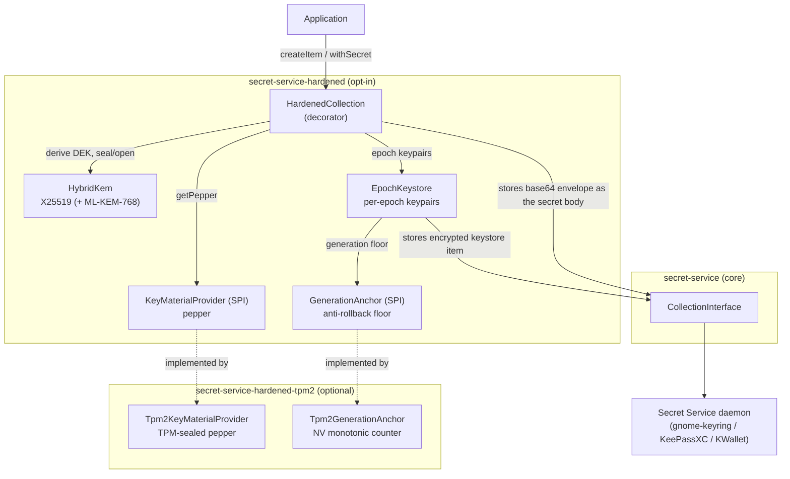
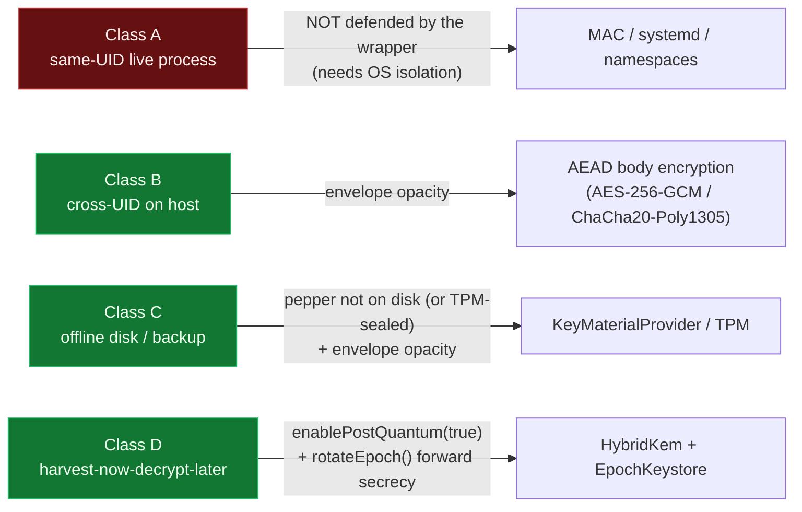

# Hardened architecture — diagrams

Visual documentation of how the **`secret-service-hardened`** application-layer encryption works, and — via the test suite — evidence that each mechanism behaves correctly.

Every diagram maps to real code and to the tests that pin the behaviour. "Correctness (proven by)" lists the JUnit methods that would fail if the property broke; run them with:

```bash
mvn test -pl hardened -am            # crypto + keystore + anchor (daemon-free)
mvn test -pl hardened-tpm2 -am -Psystem-test   # TPM paths (needs a TPM/simulator)
```

## Index

| Doc | Mechanism | Key property shown |
|-----|-----------|--------------------|
| [envelope-encryption.md](envelope-encryption.md) | Per-item AEAD envelope (AES-256-GCM or ChaCha20-Poly1305), HKDF-derived DEK | Round-trips; fails closed on wrong key material or tampering |
| [hybrid-kem.md](hybrid-kem.md) | X25519 (+ optional ML-KEM-768) KEM | Encapsulate/decapsulate agree; hybrid is honest |
| [epoch-keystore-and-forward-secrecy.md](epoch-keystore-and-forward-secrecy.md) | Per-epoch keypairs, create-then-delete persistence, `rotateEpoch` | No data loss on crash; destroyed epochs are unreadable |
| [anti-rollback-anchor.md](anti-rollback-anchor.md) | `GenerationAnchor` + TPM NV monotonic counter | A rolled-back keystore is refused (fail-closed) |
| [key-material-providers.md](key-material-providers.md) | Provider SPI, Argon2 stretching, TPM sealing | Pepper never at rest in cleartext; wrong password fails |

## Component overview



The daemon only ever sees a base64 **envelope** (ciphertext + metadata), never the plaintext. The pepper — the root of the wrapping keys — lives only in the `KeyMaterialProvider` (an env var, a mode-0600 file, or TPM-sealed), never in the daemon.

## Threat-class mapping

See the [threat catalogue](../security/threat-catalogue.md) for the full catalogue.


