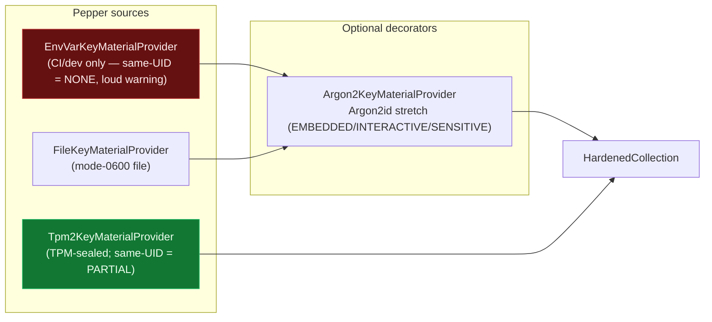
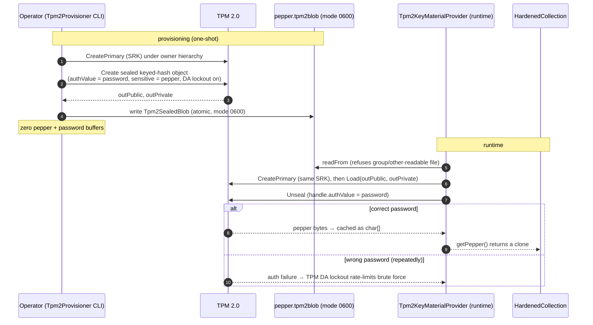

# Key material providers

The **pepper** is the root of every wrapping key. A `KeyMaterialProvider` supplies it and honestly declares its `ThreatCoverage`. Providers **compose** as decorators, so you stack a source with optional stretching. The pepper is handed out as a fresh `char[]` the caller zeroes; providers holding state scrub themselves on `close()`.

Source: `KeyMaterialProvider` (SPI) and `providers/*`; `Tpm2KeyMaterialProvider`, `Tpm2Provisioner`, `Tpm2SealedBlob` (tpm2).

## Provider composition

The builder **refuses** a provider whose `ThreatCoverage` rates same-UID as `NONE` (e.g. `EnvVarKeyMaterialProvider`) unless the caller explicitly calls `acknowledgeSameUidExposure(true)` — so a weak dev provider can never be shipped to production silently.

## TPM sealing — provision once, unseal at runtime

At rest the disk holds only TPM-wrapped material — no plaintext pepper, no env var. Recovering it needs *both* the specific TPM and the policy secret (password). See [anti-rollback-anchor.md](anti-rollback-anchor.md) for the sibling `Tpm2GenerationAnchor` NV counter.

## Correctness (proven by)

Core providers (daemon-free):

| Property | Test |
|----------|------|
| The builder refuses a same-UID=`NONE` provider without acknowledgement | `HardenedCollectionTest.refusesWeakProviderWithoutAcknowledgement`, `builderRequiresKeyMaterialAtCompileTime` |
| `close()` propagates to the provider only when owned (`ownsProvider` / `ownsInner`) | `HardenedCollectionTest.ownershipFlagsOptBackIntoClosing` |
| Argon2id stretching is wired and profiled | `Argon2KeyMaterialProviderTest.*` |
| Health check flags a weak provider and round-trips a canary | `HardenedHealthCheckTest.healthCheckFlagsWeakProviderAsWarn`, `healthCheckRoundTripsACanary` |

TPM (tpm2 module; blob tests run anywhere, unseal is simulator-gated):

| Property | Test |
|----------|------|
| Seal → unseal round-trips the pepper via the (simulated) TPM | `Tpm2KeyMaterialProviderTest.sealUnsealRoundTripViaSimulator` |
| A wrong password fails to unseal | `Tpm2KeyMaterialProviderTest.wrongPasswordFailsToUnseal` |
| The sealed-blob file is mode-0600 and rejects over-permissive files | `Tpm2SealedBlobTest.fileRoundTripSetsMode0600`, `readFromRejectsOverPermissiveFile` |
| The blob format round-trips and rejects bad magic / unknown policy | `Tpm2SealedBlobTest.binaryRoundTripPreservesAllFields`, `rejectsBadMagic`, `rejectsUnknownPolicyKind` |
| The provisioner CLI refuses unsafe argument combinations | `Tpm2ProvisionerArgsTest.*` (e.g. `parseRejectsBothPasswordAndPepperOnStdin`) |
| `Tpm2Availability.isAvailable()` reflects TSS.Java on the classpath without forcing init | `Tpm2AvailabilityTest.isAvailableReflectsTssJavaOnTheClasspath` |
