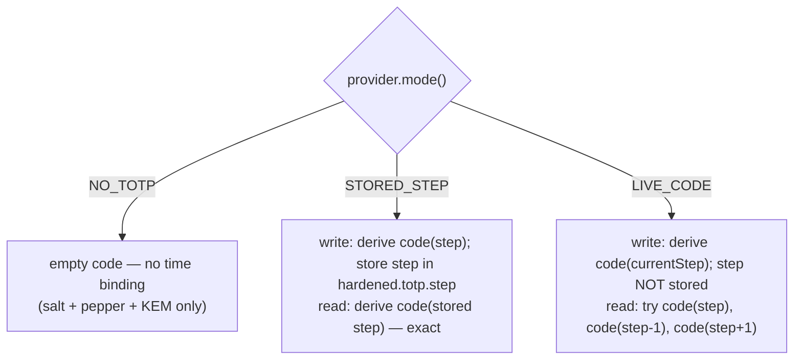
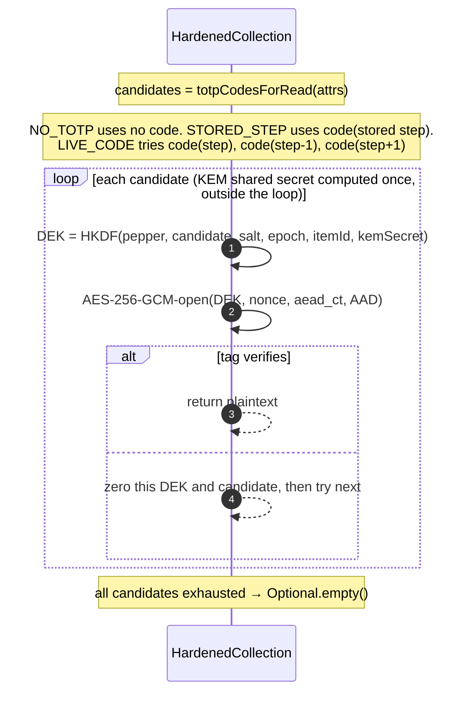

# TOTP time-binding

Optionally, a TOTP code derived from a shared seed is mixed into the DEK, so a read must present the code for the **same 30-second step** used at write time. Three modes, declared by the `KeyMaterialProvider`:

Source: `KeyMaterialProvider.Mode`, `Totp`, `HardenedCollection.totpCodeForWrite` / `totpCodesForRead`.

## Read candidate loop (how ±1 tolerance and exact-step both work)

- `STORED_STEP` re-derives the exact step recorded at write time, so it round-trips indefinitely — and the step is captured **once** per `createItem` so a rollover between the derivation and the attribute write can't desync it.
- `LIVE_CODE` stores no step; a read within ±1 step (i.e. up to the next/previous 30s window) still matches, but a read two steps later does not — the "write window ≈ read window" property the mode advertises.

## Correctness (proven by)

| Property | Test |
|----------|------|
| `STORED_STEP` round-trips with the same seed | `HardenedCollectionTest.storedStepTotpRoundTripsWithSameSeed` |
| A step rollover *during write* does not desync the stored step | `storedStepSurvivesStepRolloverDuringWrite` |
| `LIVE_CODE` tolerates ±1 step but not 2 | `liveCodeToleratesOneStepDriftButNotTwo` |
| TOTP codes are deterministic, seed- and step-sensitive, length-respecting | `TotpTest.codeIsDeterministicAndLengthRespected`, `codeChangesWithSeed`, `codeChangesWithStep` |
| Step counter is deterministic for a fixed instant; rejects bad seeds/steps | `TotpTest.currentStepIsDeterministicForFixedInstant`, `rejectsEmptySeedAndBadSize`, `stepValidatesPositive` |
